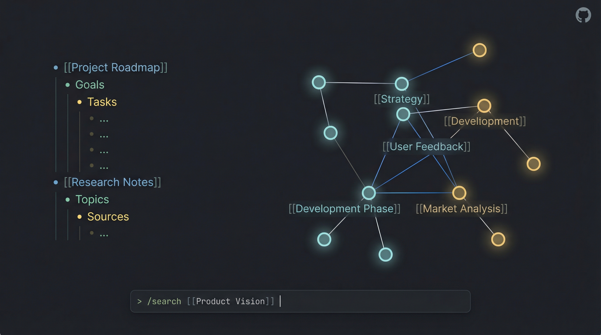

# Roam Research MCP + CLI

[](https://badge.fury.io/js/roam-research-mcp)
[](https://www.repostatus.org/#active)
[](https://opensource.org/licenses/MIT)
[](https://github.com/2b3pro/roam-research-mcp/blob/main/LICENSE)

<a href="https://glama.ai/mcp/servers/fzfznyaflu"></a>
<a href="https://mseep.ai/app/2b3pro-roam-research-mcp"></a>

## Introduction

I created this project to solve a personal problem: I wanted to manage my Roam Research graph directly from **Claude Code** (and other LLMs). As I built the [Model Context Protocol (MCP)](https://modelcontextprotocol.io/) server to give AI agents access to my notes, I realized the underlying tools were powerful enough to stand on their own.

What started as an backend for AI agents evolved into a full-featured **Standalone CLI**. Now, you can use the same powerful API capabilities directly from your terminal—piping content into Roam, searching your graph, and managing tasks—without needing an LLM at all.

Whether you want to give Claude superpowers over your knowledge base or just want a robust CLI for your own scripts, this project has you covered.

## Standalone CLI: `roam`

The `roam` CLI lets you interact with your graph directly from the terminal. It supports **standard input (stdin) piping** for all content creation and retrieval commands, making it perfect for automation workflows.

### Quick Examples

```bash
# Save a quick thought to your daily page
roam save "Idea: A CLI for Roam would be cool"

# Pipe content from a file to a new page
cat meeting_notes.md | roam save --title "Meeting: Project Alpha"

# Create a TODO item on today's daily page
echo "Buy milk" | roam save --todo

# Prepend to top of page (newest-first ordering)
roam save -p "Changelog" --order first "v2.18.0 release"

# Search your graph and pipe results to another tool
roam search "important" --json | jq .

# Search for pages by namespace prefix
roam search --namespace "Convention"    # Finds all Convention/* pages

# Fetch a page by title
roam get "Roam Research"

# Fetch daily pages using any date format (auto-normalized)
roam get today                          # Today's daily page
roam get 2026-03-21                     # ISO date → "March 21st, 2026"
roam get "03/21/2026"                   # US date → "March 21st, 2026"
roam get "March 21"                     # Named (assumes current year)

# Fetch a block with ancestors (parent chain to page root)
roam get abc123def -a              # Block + children + ancestors
roam get abc123def -a -d 0         # Ancestors only, no children

# Fetch page by UID or Roam URL
roam get page abc123def
roam get page "https://roamresearch.com/#/app/my-graph/page/abc123def"

# Sort and group results
roam get --tag Project --sort created --group-by tag

# Find references (backlinks) to a page
roam refs "Project Alpha"

# Update a block (e.g., toggle TODO status)
roam update ((block-uid)) --todo

# Multi-graph: read from a specific graph
roam get "Page Title" -g work

# Multi-graph: write to a protected graph
roam save "Note" -g work --write-key "$ROAM_SYSTEM_WRITE_KEY"
```

**Available Commands:** `get`, `search`, `save`, `refs`, `update`, `batch`, `rename`, `status`, `server`.
Run `roam <command> --help` for details on any command.

### Installation

```bash
npm install -g roam-research-mcp
# The 'roam' command is now available globally
```

---

## MCP Server Tools

The MCP server exposes these tools to AI assistants (like Claude), enabling them to read, write, and organize your Roam graph intelligently.

> **Multi-Graph Support:** All tools accept optional `graph` and `write_key` parameters. Use `graph` to target a specific graph from your `ROAM_GRAPHS` config, and `write_key` for write operations on protected graphs.

| Tool Name | Description |
| :--- | :--- |
| `roam_fetch_page_by_title` | Fetch page content by title. |
| `roam_fetch_page_full_view` | Fetch a page's content plus all linked references with breadcrumb context and children. |
| `roam_fetch_block` | Fetch a block by UID with optional children (depth) and/or ancestors (up to page root). |
| `roam_create_page` | Create new pages, optionally with mixed text and table content. |
| `roam_update_page_markdown` | Update a page using smart diff (preserves block UIDs). |
| `roam_get_subpages` | List sub-pages under a namespace prefix (e.g. "Project/") with optional tag filter. |
| `roam_search_by_text` | Full-text search across the graph or within specific pages. Supports namespace prefix search for page titles. |
| `roam_search_block_refs` | Find blocks that reference a page, tag, or block UID. |
| `roam_search_by_status` | Find TODO or DONE items. |
| `roam_search_for_tag` | Find blocks containing specific tags (supports exclusion). |
| `roam_search_by_date` | Find blocks/pages by creation or modification date. |
| `roam_find_pages_modified_today` | List pages modified since midnight. |
| `roam_add_todo` | Add TODO items to today's daily page. |
| `roam_create_table` | Create properly formatted Roam tables. |
| `roam_create_outline` | Create hierarchical outlines. |
| `roam_process_batch_actions` | Execute multiple low-level actions (create, move, update, delete) in one batch. |
| `roam_move_block` | Move a block to a new parent or position. |
| `roam_remember` / `roam_recall` | specialized tools for AI memory management within Roam. |
| `roam_datomic_query` | Execute raw Datalog queries for advanced filtering. |
| `roam_markdown_cheatsheet` | Retrieve the Roam-flavored markdown reference. |

---

## Configuration

### Environment Variables

#### Single Graph Mode

For a single Roam graph, set these in your environment or a `.env` file:

```bash
ROAM_API_TOKEN=your-api-token
ROAM_GRAPH_NAME=your-graph-name
```

#### Multi-Graph Mode (v2.0+)

Connect to multiple Roam graphs from a single server instance:

```bash
ROAM_GRAPHS='{
  "personal": {"token": "token-1", "graph": "personal-db", "memoriesTag": "#[[Personal Memories]]"},
  "work": {"token": "token-2", "graph": "work-db", "protected": true, "memoriesTag": "#[[Work Memories]]"},
  "research": {"token": "token-3", "graph": "research-db"}
}'
ROAM_DEFAULT_GRAPH=personal
ROAM_SYSTEM_WRITE_KEY=your-secret-key
```

**Graph Configuration Options:**

| Property | Required | Description |
|----------|----------|-------------|
| `token` | Yes | Roam API token for this graph |
| `graph` | Yes | Graph name/database identifier |
| `protected` | No | If `true`, writes require `ROAM_SYSTEM_WRITE_KEY` confirmation |
| `memoriesTag` | No | Tag for `roam_remember`/`roam_recall` (overrides global default) |

**Two kinds of access control (and how they differ)**

The server has two independent locks. They're easy to mix up because both are "keys" — here's the plain version (both are **optional and off by default**):

| | **Bearer token** — `HTTP_AUTH_TOKEN` | **Write key** — `ROAM_SYSTEM_WRITE_KEY` |
|---|---|---|
| In a phrase | The key to the **front door** | The latch on a **safe inside** |
| Controls | *Who can reach the server at all* | *Whether a write to a `protected` graph is allowed* |
| Covers | Everything — reads **and** writes, all graphs | Only **writes**, and only to graphs marked `protected` |
| Protects reading? | **Yes** | **No** |
| When you need it | Only if the server is reachable beyond your own machine (e.g. `-H 0.0.0.0`) | Whenever you want a guard against accidental edits to important graphs |
| How it's sent | HTTP header: `Authorization: Bearer <token>` | A `write_key` argument on write tools / CLI commands |

Think of a house: the **bearer token locks the front door** (keeps strangers out entirely), and the **write key locks a safe inside** (even someone already in the house needs it to change what's in the safe). On your own machine bound to `127.0.0.1`, the front door faces a wall — you don't need the bearer token there. The write key is still handy locally as an "are you sure?" guard, because **Roam has no undo**.

So: to mark a graph as needing the write key, set `protected: true` on it and configure `ROAM_SYSTEM_WRITE_KEY`; callers then pass a matching `write_key` for any write to that graph.

*Optional:*
- `ROAM_MEMORIES_TAG`: Default tag for `roam_remember`/`roam_recall` (fallback when per-graph `memoriesTag` not set).
- `HTTP_STREAM_PORT`: Port for the HTTP Stream transport (defaults to 8088).
- `HTTP_STREAM_HOST`: Host to bind the HTTP transport to in `--server` mode (defaults to `127.0.0.1`, loopback-only). Set to `0.0.0.0` to expose on the LAN.
- `HTTP_AUTH_TOKEN`: Optional bearer token that locks the **whole** HTTP endpoint. Unset = open (fine for loopback). When set, every MCP request must send `Authorization: Bearer <token>` (`GET /health` stays open). Use it whenever you bind beyond `127.0.0.1`. Different from `ROAM_SYSTEM_WRITE_KEY` — see [Two kinds of access control](#two-kinds-of-access-control-and-how-they-differ).

### Running the Server

**1. Default Mode (stdio + HTTP)**
Best for local integration (e.g., Claude Desktop, IDE extensions). The MCP client launches the process per session over stdio; an HTTP Stream transport is also opened on an auto-discovered port near `HTTP_STREAM_PORT`.

```bash
npx roam-research-mcp
```

**2. Shared Server Mode (`--server`)**
Best for a single long-lived, HTTP-only daemon that **multiple MCP clients share** — instead of each session spawning its own subprocess. This saves memory and gives clients a stable URL.

```bash
HTTP_STREAM_PORT=8088 npx roam-research-mcp --server
```

Or manage it through the `roam` CLI, which adds start/stop/status/logs:

```bash
roam server start            # start the shared daemon in the background
roam server start -H 0.0.0.0 # expose on the LAN (no transport auth!)
roam server status           # is it up? version, graphs, active sessions
roam server logs -f          # follow the log
roam server stop             # stop a CLI-started daemon
```

`roam server status` works no matter how the daemon was launched (it probes `/health`), so it also reports a daemon started by a LaunchAgent/systemd unit. State (pidfile + log) lives in `~/.roam/` (override with `ROAM_HOME`).

In `--server` mode the server:
- runs **HTTP-only** (no stdio transport),
- binds the **exact** `HTTP_STREAM_PORT` on `HTTP_STREAM_HOST` and **exits non-zero if the port is taken** (no silent drift — a shared daemon must keep a stable URL),
- exposes `GET /health` → `{"status":"ok", ...}` for liveness checks.

Point MCP clients at it with an HTTP transport config:

```json
{
  "mcpServers": {
    "roam-research-mcp": {
      "type": "http",
      "url": "http://127.0.0.1:8088/mcp"
    }
  }
}
```

Env vars (tokens, graphs) live with the **server** process, not the client config.

**Securing an exposed server (two layers):**
If you bind beyond loopback (`-H 0.0.0.0`), add the perimeter lock:

```bash
HTTP_AUTH_TOKEN=$(openssl rand -hex 32) roam server start -H 0.0.0.0
```

Clients then send the token as a header:

```json
{
  "mcpServers": {
    "roam-research-mcp": {
      "type": "http",
      "url": "http://<host>:8088/mcp",
      "headers": { "Authorization": "Bearer <token>" }
    }
  }
}
```

Keep **both** — they do different jobs (see [Two kinds of access control](#two-kinds-of-access-control-and-how-they-differ) above): the bearer token controls **who can connect**, the write key only guards **writes to protected graphs**.

> ⚠️ The write key is **not** a substitute for the bearer token. On an exposed server without `HTTP_AUTH_TOKEN`, anyone on the network can still **read every graph** (and write non-protected ones). For anything beyond loopback, set `HTTP_AUTH_TOKEN`.

**Keeping it running (macOS LaunchAgent):**
Create `~/Library/LaunchAgents/com.example.roam-mcp.plist` with `RunAtLoad` + `KeepAlive`, your env vars under `EnvironmentVariables`, and `--server` as the last `ProgramArguments` entry. Keep `StandardOutPath`/`StandardErrorPath` on a **local** path (e.g. `~/Library/Logs/`), then:

```bash
launchctl bootstrap gui/$(id -u) ~/Library/LaunchAgents/com.example.roam-mcp.plist
curl -s http://127.0.0.1:8088/health   # verify
```

**3. Docker**

```bash
docker run -p 8088:8088 --env-file .env roam-research-mcp --server
```

### Configuring in LLMs

**Claude Desktop / Cline:**

Add to your MCP settings file (e.g., `~/Library/Application Support/Claude/claude_desktop_config.json`):

*Single Graph:*
```json
{
  "mcpServers": {
    "roam-research": {
      "command": "npx",
      "args": ["-y", "roam-research-mcp"],
      "env": {
        "ROAM_API_TOKEN": "your-token",
        "ROAM_GRAPH_NAME": "your-graph"
      }
    }
  }
}
```

*Multi-Graph:*
```json
{
  "mcpServers": {
    "roam-research": {
      "command": "npx",
      "args": ["-y", "roam-research-mcp"],
      "env": {
        "ROAM_GRAPHS": "{\"personal\":{\"token\":\"token-1\",\"graph\":\"personal-db\",\"memoriesTag\":\"#[[Memories]]\"},\"work\":{\"token\":\"token-2\",\"graph\":\"work-db\",\"protected\":true}}",
        "ROAM_DEFAULT_GRAPH": "personal",
        "ROAM_SYSTEM_WRITE_KEY": "your-secret-key"
      }
    }
  }
}
```

## Query Block Parser (v2.11.0+)

A utility for parsing and executing Roam query blocks programmatically. Converts `{{[[query]]: ...}}` syntax into Datalog queries.

### Supported Clauses

| Clause | Syntax | Description |
|--------|--------|-------------|
| Page ref | `[[page]]` | Blocks referencing a page |
| Block ref | `((uid))` | Blocks referencing a block |
| `and` | `{and: [[a]] [[b]]}` | All conditions must match |
| `or` | `{or: [[a]] [[b]]}` | Any condition matches |
| `not` | `{not: [[tag]]}` | Exclude matches |
| `between` | `{between: [[date1]] [[date2]]}` | Date range filter |
| `search` | `{search: text}` | Full-text search |
| `daily notes` | `{daily notes: }` | Daily notes pages only |
| `by` | `{by: [[User]]}` | Created or edited by user |
| `created by` | `{created by: [[User]]}` | Created by user |
| `edited by` | `{edited by: User}` | Edited by user |

### Relative Dates

The `between` clause supports relative dates: `today`, `yesterday`, `last week`, `last month`, `this year`, `7 days ago`, `2 months ago`, etc.

### Usage

```typescript
import { QueryExecutor } from 'roam-research-mcp/query';

const executor = new QueryExecutor(graph);

// Execute a query
const results = await executor.execute(
  '{{[[query]]: "My Query" {and: [[Project]] {between: [[last month]] [[today]]}}}}'
);

// Parse without executing (for debugging)
const { name, query } = QueryParser.parseWithName(queryBlock);
```

### Utility Functions

```typescript
import { isQueryBlock, extractQueryBlocks } from 'roam-research-mcp/query';

// Detect if text is a query block
isQueryBlock('{{[[query]]: [[tag]]}}'); // true

// Extract all query blocks from a string
extractQueryBlocks(pageContent); // ['{{[[query]]: ...}}', ...]
```

---

## Support

If this project helps you manage your knowledge base or build cool agents, consider buying me a coffee! It helps keep the updates coming.

<a href="https://paypal.me/2b3/5">
  
</a>

**[https://paypal.me/2b3/5](https://paypal.me/2b3/5)**

---

## License

MIT License - Created by [Ian Shen](https://github.com/2b3pro).
